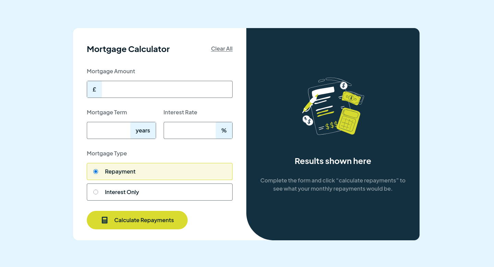

# Frontend Mentor - Mortgage repayment calculator solution

This is a solution to the [Mortgage repayment calculator challenge on Frontend Mentor](https://www.frontendmentor.io/challenges/mortgage-repayment-calculator-Galx1LXK73). Frontend Mentor challenges help you improve your coding skills by building realistic projects.

## Table of contents

- [Overview](#overview)
  - [The challenge](#the-challenge)
  - [Screenshot](#screenshot)
  - [Links](#links)
- [My process](#my-process)
  - [Built with](#built-with)
  - [What I learned](#what-i-learned)
  - [Continued development](#continued-development)
  - [Useful resources](#useful-resources)
- [Author](#author)

## Overview

### The challenge

Users should be able to:

- Input mortgage information and see monthly repayment and total repayment amounts after submitting the form
- See form validation messages if any field is incomplete
- Complete the form only using their keyboard
- View the optimal layout for the interface depending on their device's screen size
- See hover and focus states for all interactive elements on the page

### Screenshot



### Links

- Solution URL: [Add solution URL here](https://your-solution-url.com)
- Live Site URL: [https://florianstancioiu.github.io/mortgage-repayment-calculator](https://florianstancioiu.github.io/mortgage-repayment-calculator/)
- Chromatic Storybook: [https://684597d98ddc1f07beda4a18-chshwljerx.chromatic.com/?path=/docs/components-button--docs](https://684597d98ddc1f07beda4a18-chshwljerx.chromatic.com/?path=/docs/components-button--docs)

## My process

### Built with

- Semantic HTML5 markup
- CSS custom properties
- Flexbox
- CSS Grid
- Mobile-first workflow
- [Vue](https://vuejs.org/) - JS framework
- [TailwindCSS](https://tailwindcss.com/) - CSS framework
- [TypeScript](https://www.typescriptlang.org/) - Strongly typed programming language that builds on JavaScript
- [Storybook](https://storybook.js.org/) - Frontend workshop for building UI components
- [Vitest](https://vitest.dev/) - Testing framework

### What I learned

- I learned a lot about testing components using [vitest](https://vitest.dev/)
- When watching for props like `props.options.currentValue`, you must always use the `props` variable so that the `watch` function can work correctly

This code will work correctly

```js
watch(
  () => props.options.currentValue,
  (newCurrentValue) => {
    console.log(`The newCurrentValue is: ${newCurrentValue}`);
  }
);
```

This will never get triggered:

```js
const props = defineProps<{
  title: string;
  options: InputOptions;
  prefix?: string;
  suffix?: string;
}>();

const { title, options } = props;
const { currentValue, error, active } = options;

watch(
  () => currentValue,
  (newCurrentValue) => {
    console.log(`The newCurrentValue is: ${newCurrentValue}`);
  }
);
```

### Useful resources

- [Component decorators](https://storybook.js.org/docs/writing-stories/decorators#component-decorators) - This helped me set slot content to the Button component in Storybook
- [Vue 3 with Typescript 'Could Not Find A Declaration File'](https://stackoverflow.com/a/78137284/12159189) - This helped me debug an issue with a story file
- [::before and ::after](https://tailwindcss.com/docs/hover-focus-and-other-states#before-and-after) - ~~This helped me use before pseudo element in TailwindCSS~~ It turns out it's easier to just use a new element instead of using `::before` or `::after`
- [Monthly payment formula](https://en.wikipedia.org/wiki/Mortgage_calculator#Monthly_payment_formula) - I tried using this formula but it just didnt yield the right results, so I turned and asked chatgpt for the mortgage formula in the UK - and it worked
- [Number.prototype.toLocaleString()](https://developer.mozilla.org/en-US/docs/Web/JavaScript/Reference/Global_Objects/Number/toLocaleString#using_options) - This helped me format the floating point numbers to use a maximum of 2 decimal places
- [Vue Test Utils v2](https://test-utils.vuejs.org/guide/) - This helped me write the tests for the components
- [:nth-child()](https://developer.mozilla.org/en-US/docs/Web/CSS/:nth-child) - This helped me remember whether nth-child is 0 based or not - it isn't

## Author

- Frontend Mentor - [@florianstancioiu](https://www.frontendmentor.io/profile/florianstancioiu)
- Threads - [@florianstancioiu01](https://www.threads.com/@florianstancioiu01)
- LinkedIn - [florianstancioiu](https://www.linkedin.com/in/florian-stancioiu-765661349/)
- freeCodeCamp - [florianstancioiu](https://www.freecodecamp.org/florianstancioiu)
